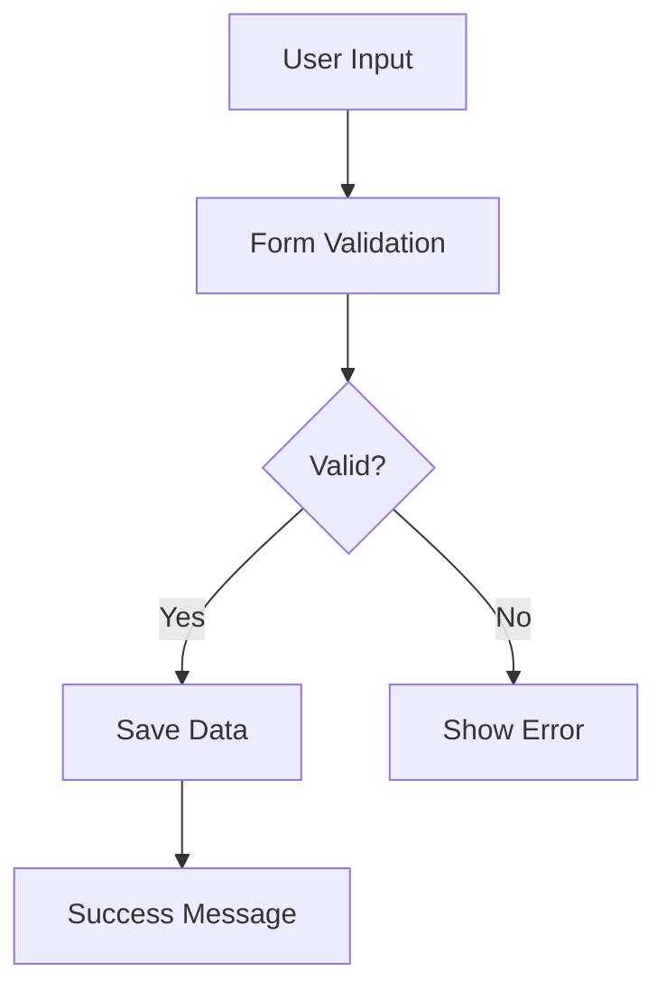
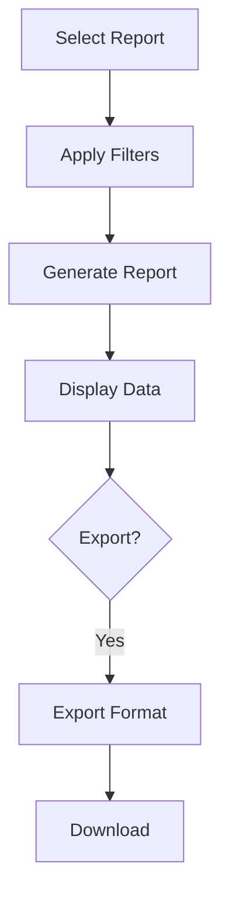

# Satsang Management System - Technical Documentation

## Code Structure

### Main Components

1. **App Configuration**
```python
st.set_page_config(
    page_title="Satsang Management System",
    layout="wide"
)
```

2. **State Management**
```python
# Session State Variables
st.session_state.current_page  # Current active page
st.session_state.show_filters  # Filter visibility state
st.session_state.current_report  # Active report type
```

3. **Navigation System**
- Parent navigation items: Data Entry, Reports, Settings
- Reports sub-navigation: Average Sangat Report, Centre Listing Report
- Dynamic routing based on session state

### Component Architecture

#### 1. Data Entry Module (`create_data_entry()`)
- Tab-based interface for Main and Baal Satsang
- Form validation and data collection
- Common vehicle details section
- Action handlers for save and cancel operations

#### 2. Reporting Module
a. **Average Sangat Report** (`create_average_sangat_report()`)
```python
{
    "filters": {
        "year": "range(2020, 2026)",
        "satsang_type": ["Main", "Baal"],
        "language": ["All", "English", "Hindi", "Punjabi"],
        "time_slot": ["All", "Morning", "Evening"],
        "geographic": {
            "zone": ["All", "Zone-2", "Zone-3"],
            "state": ["All", "Punjab", "Haryana"],
            "area": ["All", "Area A", "Area B"]
        }
    },
    "output_structure": {
        "Zone": "string",
        "State": "string",
        "Area": "string",
        "Name of Centre": "string",
        "Metrics": {
            "Sundays": "integer",
            "Wednesday": "integer",
            "Thursday": "integer",
            "Other Weekdays": "integer",
            "English": "integer",
            "Baal Satsang": "integer"
        }
    }
}
```

b. **Centre Listing Report** (`create_centre_listing_report()`)
```python
{
    "filters": {
        "geographic": {
            "zone": "string",
            "state": "string",
            "area": "string",
            "centre_name": "string"
        },
        "satsang_info": {
            "centre_type": ["C", "SC", "P"],
            "satsang_type": ["Main", "Baal"],
            "language": ["English", "Hindi", "Punjabi"],
            "time_slot": ["Morning", "Evening"],
            "preacher": {
                "type": "string",
                "gender": "string",
                "grade": ["A", "B", "C", "D", "E"]
            }
        },
        "sangat_count": {
            "male": {"min": "integer", "max": "integer"},
            "female": {"min": "integer", "max": "integer"},
            "children": {"min": "integer", "max": "integer"}
        }
    }
}
```

#### 3. Settings Module (`create_settings()`)
- User profile management
- Notification preferences
- Role-based settings

### UI Components

#### 1. Custom CSS Classes
```css
.report-header {
    background-color: white;
    padding: 1rem;
    border-radius: 4px;
    margin-bottom: 1rem;
    box-shadow: 0 1px 3px rgba(0,0,0,0.1);
}

.advanced-filters {
    background-color: white;
    padding: 1.5rem;
    border-radius: 8px;
    box-shadow: 0 2px 4px rgba(0,0,0,0.05);
    margin: 1rem 0;
    border: none;
}

.filter-toggle {
    background-color: #f8f9fa;
    padding: 0.5rem 1rem;
    border-radius: 6px;
    border: 1px solid #e9ecef;
}
```

#### 2. Layout Components
- Responsive grid system using `st.columns()`
- Tab-based interface using `st.tabs()`
- Container-based sections using `st.container()`

### Data Flow

1. **Data Entry Flow**


2. **Report Generation Flow**


### Function Signatures

```python
def create_data_entry():
    """
    Creates the data entry interface for Satsang details.
    Returns: None
    Side effects: Updates UI and session state
    """

def create_average_sangat_report():
    """
    Generates and displays the Average Sangat Report.
    Returns: None
    Side effects: Updates UI with report data
    """

def create_centre_listing_report():
    """
    Generates and displays the Centre Listing Report.
    Returns: None
    Side effects: Updates UI with report data
    """

def create_settings():
    """
    Manages user settings and preferences.
    Returns: None
    Side effects: Updates user settings in session state
    """
```

### Error Handling

1. **Form Validation**
- Required field checks
- Data type validation
- Range validation for numeric inputs

2. **Report Generation**
- Empty data handling
- Filter validation
- Export format validation

### Performance Considerations

1. **Data Loading**
- Lazy loading for reports
- Pagination for large datasets
- Caching for frequently accessed data

2. **UI Optimization**
- Conditional rendering
- State management optimization
- Component reuse

### Testing Strategy

1. **Unit Tests**
- Form validation
- Data processing
- Filter logic

2. **Integration Tests**
- Navigation flow
- Report generation
- Export functionality

3. **UI Tests**
- Component rendering
- Responsive design
- User interactions

### Deployment

1. **Requirements**
```
streamlit==1.x.x
pandas==1.x.x
Pillow==8.x.x
```

2. **Environment Variables**
```
STREAMLIT_SERVER_PORT=8501
STREAMLIT_SERVER_ADDRESS=0.0.0.0
```

3. **Run Command**
```bash
streamlit run app.py
```

### API Integration Points

1. **Data Storage**
- Database connection points
- Data retrieval methods
- Update operations

2. **Export Services**
- Excel generation
- PDF generation
- File handling

### Security Implementation

1. **Input Validation**
- Sanitization of user inputs
- Type checking
- Range validation

2. **Access Control**
- Role-based access
- Session management
- Authentication hooks

### Monitoring and Logging

1. **Application Metrics**
- User activity
- Report generation
- Error tracking

2. **Performance Metrics**
- Response times
- Resource usage
- Cache hit rates

---

## Development Guidelines

### Code Style
- Follow PEP 8
- Use type hints
- Document all functions
- Maintain consistent naming conventions

### Version Control
- Feature branches
- Semantic versioning
- Detailed commit messages
- Pull request templates

### Documentation
- Update technical docs with changes
- Include code examples
- Document breaking changes
- Maintain changelog

---
*This technical documentation is intended for developers and AI tools working with the Satsang Management System.* 